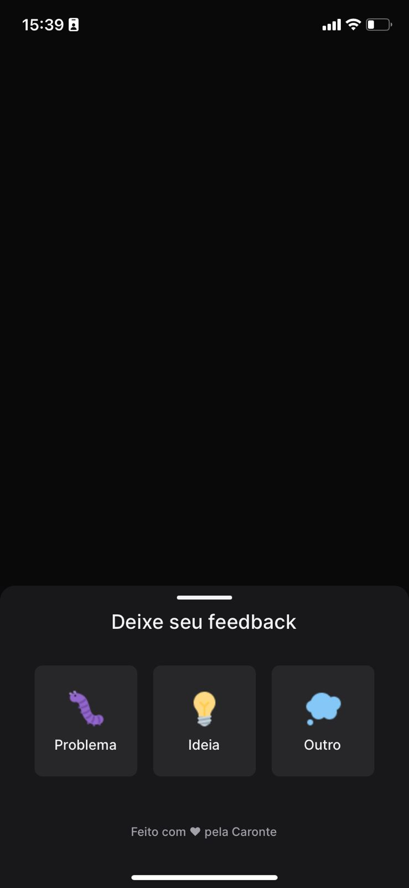

<h1 align="center">FeedWidget Mobile</h1>

 

<!-- Imagem que representa o que o projeto faz-->
| | 
| :---: |

## Index
  1. [Descrição do Projeto](#descrição)
  2. [Técnicas e Tecnologias](#tecnologias)
  3. [Abrir e executar o projeto](#executar_o_projeto)
  4. [Features do Projeto](#project_features)
  5. [Pessoas que ajudaram a desenvolver o projecto](#developers)
  6. [English Readme](./READMEEnglish.md)

### Descrição do Projeto 
###### descrição
Este projeto mobile foi pensado inicialmente como WEB para ser algo "Simples", mas que me ajude a estudar reactJS, reactNative(agora com a versão mobile) e nodeJS - se preocupando com a acessibilidade. O objetivo do projeto é ser um widget onde o usuário poderá enviar feedback, seja um bug, uma ideia de melhoria ou qualquer outro feedback que não se enquadre nessas outras duas categorias, além disso, o usuário terá a opção de inserir uma imagem da tela, mas este não terá que tirar um print, já que ao clicar no botão o print é feito automaticamente e aplicada no feedback. Ao enviar esse feedback, ele é inserido em um banco de dados e enviado por e-mail aos desenvolvedores.

### Técnicas e Tecnologias
###### tecnologias
- React
- Phosphor-react (para os ícones)
- React-Native
- Typescript
- Expo
- Axios

## 🛠️ Abrir e executar o projeto
###### executar_o_projeto
#### 1- Clone o Projeto

#### 2- Instale todas as dependências
   `npm install`

#### 3- Transformar o arquivo `api.example.ts` em `api.ts`
   `expo run dev`

#### 4- (Você tem que ter [EXPO](https://docs.expo.dev/get-started/installation/) instalado no seu computador) Execute o projeto 
   `expo run dev`

### 🔨 Features do Projeto
###### project_features
- `Hover`:  Ao passar o mouse sob o widget uma transição de cor ocorrerá  e aparecerá um texto escrito 'feedback'
- `Escolha da categoria`: É possível escolher a categoria do feedback ao clicar no widget
- `Print Automático`: Ao clicar no botão (depois de selecionar a categoria) um print automático da tela é tirado e já inserido ao feedback

## Desenvolvedora do projeto
###### developers
| [ Carolina Teixeira Coelho](https://github.com/caroolt) | 
| :---: |

